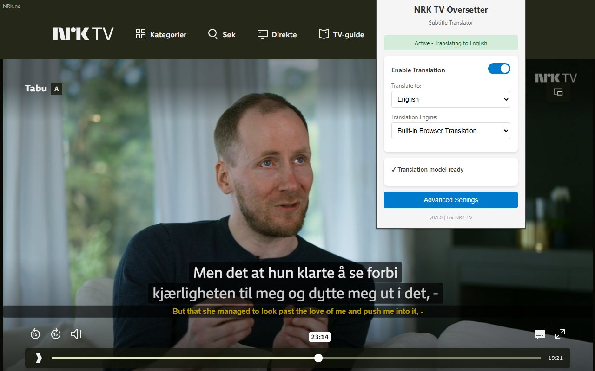
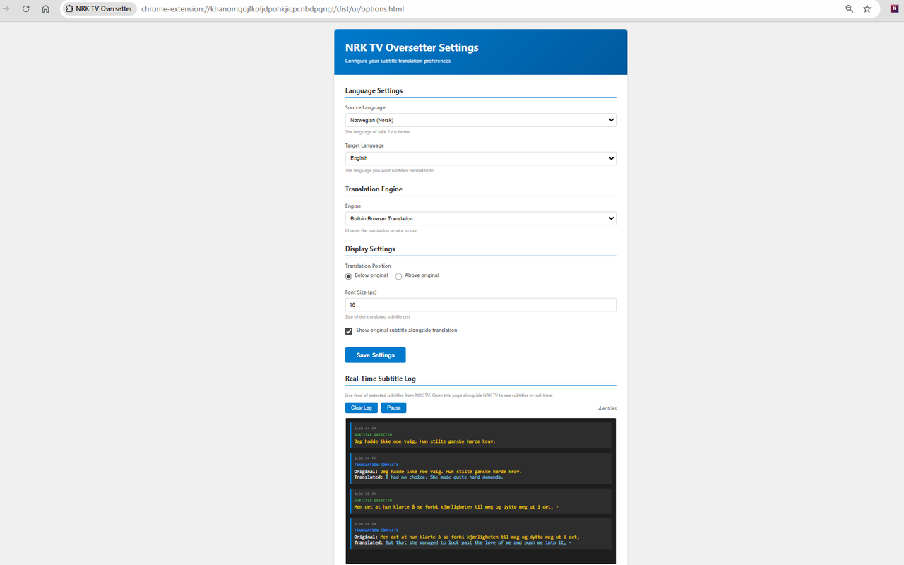

# NRK TV Oversetter

Translate Norwegian subtitles on [NRK TV](https://tv.nrk.no) in real-time, using the translation model built into your browser. Nothing you watch leaves your device.

[](https://chromewebstore.google.com/detail/nrk-tv-oversetter/hlnikafacjiekphhloakkbhokhfkpcem)
[](LICENSE)



## Install

| Browser | Status |
| --- | --- |
| **Chrome** | [Chrome Web Store](https://chromewebstore.google.com/detail/nrk-tv-oversetter/hlnikafacjiekphhloakkbhokhfkpcem) |
| **Edge** | Coming soon — Edge Add-ons submission pending |

## Browser support

Translation runs on the browser's built-in [Translator API](https://developer.chrome.com/docs/ai/translator-api), so support depends on your browser version:

| Browser | Minimum version | Languages available to the API |
| --- | --- | --- |
| Chrome | Stable | 44 |
| Microsoft Edge | **148+** | 145+ |

Edge shipped the Translator API to **stable in Edge 148**. Earlier Edge versions required Canary; that is no longer the case. If you are on Edge, update to 148 or later.

## Features

- Real-time translation of Norwegian subtitles as you watch
- **Every language your browser supports** — the list is read from the browser at runtime, so it is around 39 on Chrome and 145+ on Edge 148, rather than a fixed list that goes stale
- Optionally hide the Norwegian original and show only the translation
- Translation size that scales with NRK's own subtitles, so it stays in proportion in fullscreen and on small windows — or a fixed pixel size if you prefer
- Models download automatically, with live progress in the popup
- Works offline once the language model has downloaded
- Live subtitle log for debugging detection issues

> **Missing a language?** The list comes from your browser, so if something is absent your browser cannot translate into it yet. Edge 148+ supports considerably more than Chrome. [Open an issue](https://github.com/alcaann/nrk-tv-oversetter/issues/new/choose) if something looks wrong.



## Usage

1. Open [tv.nrk.no](https://tv.nrk.no) and start a video with Norwegian subtitles enabled
2. Click the extension icon, then **Download Translation Model** (first run only)
3. Translations appear below the Norwegian subtitles in yellow

Settings: right-click the extension icon → **Options**.

## Roadmap

- [x] Populate the language list dynamically from the browser's Translator API (fixes missing languages such as Arabic)
- [x] Download progress, shown live in the popup
- [x] Model status readable without an open NRK tab
- [ ] Injector health check, to detect and report when NRK changes their page structure
- [ ] Edge Add-ons release

## Contributing

Contributions are welcome — this is a small project and pull requests are genuinely appreciated.

- **Found a bug, or missing a language?** [Open an issue](https://github.com/alcaann/nrk-tv-oversetter/issues/new/choose). Bug reports through the extension store are hard to reply to; GitHub issues let us actually talk it through.
- **Want to fix something?** Fork, branch, and open a pull request. See [CONTRIBUTING.md](CONTRIBUTING.md) for the build and test loop.
- **Subtitles stopped being detected?** NRK changes their site occasionally. That's usually a one-line selector fix — see [docs/CAPTION_DETECTOR.md](docs/CAPTION_DETECTOR.md).

## Development

```bash
npm install
npm run build
```

Then load the unpacked extension: `chrome://extensions` (or `edge://extensions`) → enable **Developer mode** → **Load unpacked** → select the repo root.

**Commands:**

| Command | Purpose |
| --- | --- |
| `npm run build` | Full build (TypeScript + assets + bundling) |
| `npm run watch` | TypeScript in watch mode |
| `npm run clean` | Remove `dist/` |
| `npm run copy-assets` | Copy HTML/CSS into `dist/` |
| `npm run bundle-content` | Bundle the content script |

**Architecture** ([full docs](docs/ARCHITECTURE.md)):

| Path | Responsibility |
| --- | --- |
| [src/content/SubtitleProcessor.ts](src/content/SubtitleProcessor.ts) | Subtitle detection and processing |
| [src/core/translation/](src/core/translation/) | Translation engines (factory pattern) |
| [src/core/interfaces/](src/core/interfaces/) | Interfaces for extensibility |
| [src/ui/](src/ui/) | Popup and options pages |

**Adding a translation engine:** implement [ITranslationEngine](src/core/interfaces/ITranslationEngine.ts), register it in [TranslationEngineFactory.ts](src/core/translation/TranslationEngineFactory.ts), add it to the UI dropdowns.

## How it works

NRK builds their player with Lit, which updates subtitle text in ways a `MutationObserver` alone can miss. Detection therefore uses two mechanisms together:

- **MutationObserver** on the subtitle container, for DOM changes
- **500 ms polling** as a fallback, for text updates that fire no mutation

The primary selector is `span[class*="subtitle"]`, with fallbacks. Translation then goes through the browser's built-in Translator API, which runs entirely on-device.

See [docs/CAPTION_DETECTOR.md](docs/CAPTION_DETECTOR.md) for detection details.

## Troubleshooting

**No translations appearing?**
- On Edge, confirm you are on version 148 or later (`edge://settings/help`)
- Download the translation model from the popup first
- Refresh the NRK TV page after enabling the extension

**Model download stuck or failing?**
- Restart the browser and try again — this is a known quirk of the built-in model download
- Check the browser console (F12) for errors

**Subtitles not being detected?**
- NRK may have changed their HTML structure
- [Open an issue](https://github.com/alcaann/nrk-tv-oversetter/issues/new/choose) — include the video you were watching
- To fix it yourself, update the selectors in [SubtitleProcessor.ts](src/content/SubtitleProcessor.ts#L129-L152)

## Privacy

Subtitles are translated on your device by the browser's built-in model. No subtitle text, browsing history, or personal data is transmitted anywhere. See [PRIVACY.md](PRIVACY.md).

## License

[MIT](LICENSE)
